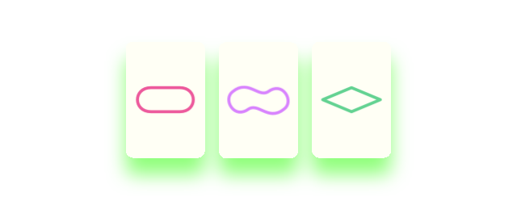

# SET! Card Game [WIP]

I am in the proccess of tinkering around this iOS game built using UIKit. Started this project mostly to learn about producing animations, but currently I am looking into changing gameplay mechanics, adding story line and making it into polished game to be published on AppStore. WIP so many essential things are missing (tutorial, highscores, animated score view...).


## SET! Game Mechanics:

Player needs to find such three cards that together must fulfill all four following conditions at the same time:
 * ```All three cards have all the same shape on them``` OR ```each card must have different shape```
 * ```All three cards have all the same color on them``` OR ```each card must have different color```
 * ```All three cards have all the same shape filling on them``` OR ```each card must have different shape filling```
 * ```All three cards have all the same number of shapes on them``` OR ```each card must have different number of shapes```

## Game Mechanics Examples

According to rules from above, following three cards together **MAKE** set:



And following three cards together **DON'T MAKE** set:


## Xcode
Built on Xcode 10.3, target iOS 11 or higher.

Using **CocoaPods** and **Lottie** animation framework for future AfterEffects to Xcode animations workflow.

Game has two screens:
- Gameplay screen (```GraphicalSetViewController.swift```)
- Pause menu screen (```MenuViewController.swift```)

Both of them to be found in Main.storyboard. Featuring custom transition animation between the two MVCs.

Interactive cards are custom UIViews (```PlayingCardButton``` - has subview ```PlayingCardView``` - has subviews ```ShapeView```). ```ShapeView``` is custom UIView featuring custom drawing. All the card glyphs are drawn in ```ShapeView``` from code as vectors and therefore look nice and sharp upscaled on eg. big iPad screen. *Playing cards are to be revisited due to higher performance costs when higher amount of cards are on table*.

Many Constants to configure in one place ```ExtensionConstants.swift``` including possibility to switch to cheat mode:
```swift
static let cheatModeIsActive = false
```
when activated every three cards combination are sets.

## Credits

- App developed by Lukáš Lízal [[link to web](http://www.lukaslizal.com)]
- ```Grid.swift``` made by Paul Hegarty as part of his Standford course CS193p Programming iOS Applications. Copyright © 2017 Stanford University.

## License
[MIT](https://choosealicense.com/licenses/mit/)
